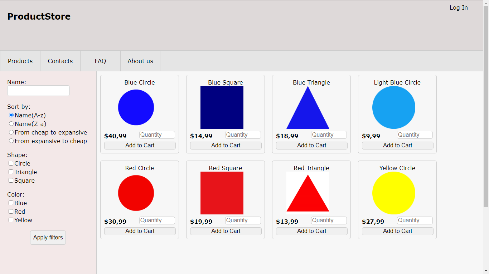
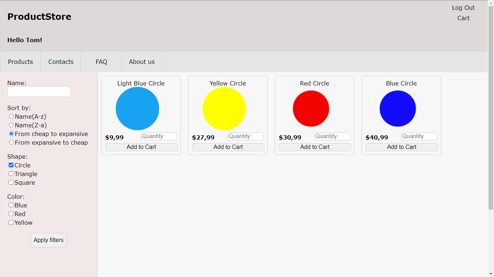
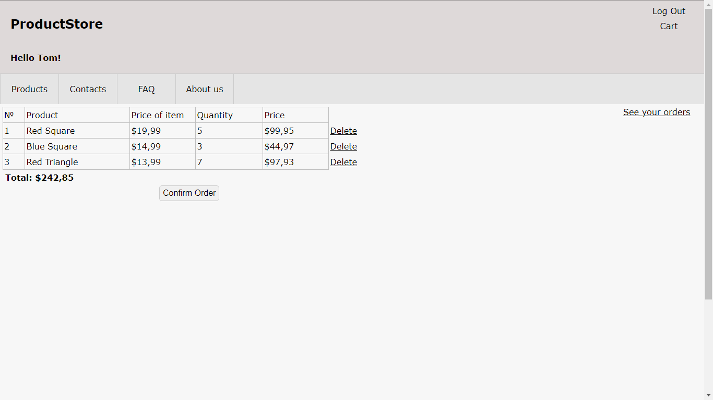
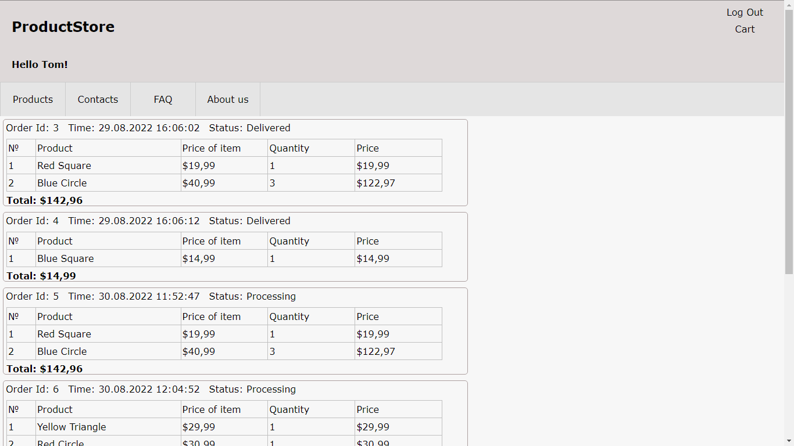
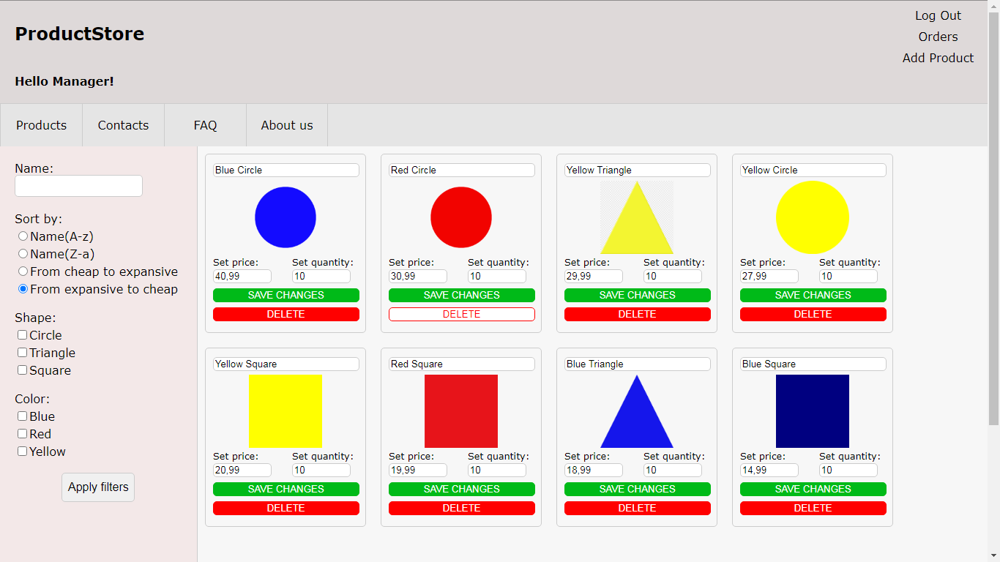

# Asp.Net Core MVC e-commerce app
Online shopping application where some geometrical shapes used as samples of products.
User can  browse product catalog applying filters, adding some goods to his shopping cart and placing orders.
In this webapp implemented cookie-based authentication with two roles:"manager" and "customer".
Manager has additional abilities to control over online shop.

#### Starting page: 

#### Filters applied, user logged in:

#### Shopping cart:

#### Orders list:

#### Manager page:

# Features
- C#
- HTML
- CSS
- Asp.Net Core 5
- MVC
- Cookies
- Authorization/Authentication
- Visual Studio 2019 IDE
